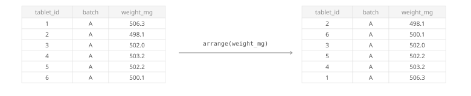




<div class="source-links">
<a class="source-link" href="https://dplyr.tidyverse.org/reference/arrange.html" target="_blank" rel="noopener">Original Documentation ↗</a>
<a class="source-link" href="https://rstudio.github.io/cheatsheets/html/data-transformation.html" target="_blank" rel="noopener">dplyr Cheatsheet ↗</a>
</div>

## Required Library
```r
install.packages("tidyverse")
library(tidyverse)
```

## Syntax

```{r, eval=FALSE}
# Pipe style
df %>% arrange(column)

# Non-pipe style
arrange(df, column)
```
::: {.desc-item}
`df %>% arrange(column)` and `arrange(df, column)` sort the rows of a data frame by the chosen column.
By default, values are sorted in ascending order.


:::

```{r, eval=FALSE}
df %>% arrange(column1, desc(column2))
```
::: {.desc-item}
Use more than one column when rows should be sorted by a primary key and then a secondary key.
Wrap a column in `desc()` when you want descending order.
:::

::: {.callout-tip collapse="true"}
## When do you use `arrange()`?
Use `arrange()` when row order matters for inspection, printing, or downstream steps.
Common examples are finding the greatest or smallest values, ordering time points, or sorting batches before export.
:::

## Examples

<div class="example-section">
<div class="collapse-toolbar"><button class="collapse-btn">Expand All</button></div>

<details class="example-item">
<summary>Sort one column in ascending order</summary>
<div class="example-body">

```{webr}
library(tidyverse)

tablet_weights <- read_csv("data/tablet_weights.csv")

tablet_weights %>%
  arrange(weight_mg)
```
</div>
</details>

<details class="example-item">
<summary>Sort one column in descending order</summary>
<div class="example-body">

```{webr}
library(tidyverse)

tablet_weights <- read_csv("data/tablet_weights.csv")

tablet_weights %>%
  arrange(desc(weight_mg))
```
</div>
</details>

<details class="example-item">
<summary>Sort by more than one column</summary>
<div class="example-body">
First sort by batch, then sort within each batch by tablet weight.

```{webr}
library(tidyverse)

tablet_weights <- read_csv("data/tablet_weights.csv")

tablet_weights %>%
  arrange(batch, weight_mg)
```
</div>
</details>

<details class="example-item">
<summary>Arrange grouped data with <code>.by_group = TRUE</code></summary>
<div class="example-body">
When data is already grouped, `.by_group = TRUE` keeps rows ordered by group first, then by the columns you supply.

```{webr}
library(tidyverse)

dissolution <- read_csv("data/dissolution.csv")

dissolution %>%
  group_by(tablet_id) %>%
  arrange(time_min, .by_group = TRUE)
```
</div>
</details>

<details class="example-item">
<summary>See where missing values go</summary>
<div class="example-body">

```{webr}
library(tidyverse)

assay_results <- tibble(
  sample_id = c("S1", "S2", "S3", "S4"),
  assay_pct = c(99.4, NA, 97.8, 101.2)
)

assay_results %>%
  arrange(assay_pct)
```
</div>

::: {.callout-note collapse="true"}
## Missing values are sorted last
For ordinary data frames and tibbles, `arrange()` places `NA` values at the end, even when sorting in descending order.
:::

</details>


</div>

## Argument Overview
<p class="arg-intro">Required arguments must be included when using a function while optional arguments can be included on demand.</p>

::: {.arg-section}
<div class="collapse-toolbar"><button class="collapse-btn">Expand All</button></div>

<details class="arg-item">
<summary><code>.data</code> <span class="arg-types">data frame | tibble</span> <span class="arg-badge required">Required</span></summary>
<div class="arg-body">
The data frame to sort. In a pipe (`%>%`), this is passed automatically from the left-hand side.

```r
tablet_weights %>% arrange(weight_mg)
```

<p class="data-types"><strong>Data Types:</strong> <code>data.frame</code> | <code>tibble</code></p>
</div>
</details>

<details class="arg-item">
<summary><code>...</code> — sorting columns or expressions <span class="arg-types">column name(s) | expression(s)</span> <span class="arg-badge required">Required</span></summary>
<div class="arg-body">
One or more columns to sort by. Earlier columns have higher priority.
Use `desc(column_name)` to reverse the sorting direction for a column.

```r
arrange(tablet_weights, batch, desc(weight_mg))
```

<p class="data-types"><strong>Data Types:</strong> column names or expressions such as <code>desc(weight_mg)</code></p>
</div>
</details>

<details class="arg-item">
<summary><code>.by_group</code> — sort by grouping variables first <span class="arg-types">logical</span> <span class="arg-badge optional">Optional</span></summary>
<div class="arg-body">
When the data is already grouped, `.by_group = TRUE` sorts rows by the grouping columns before applying the sorting columns in `...`.

```r
dissolution %>%
  group_by(tablet_id) %>%
  arrange(desc(time_min), .by_group = TRUE)
```

<p class="data-types"><strong>Data Types:</strong> <code>logical</code> · Default: <code>FALSE</code></p>
</div>
</details>

<details class="arg-item">
<summary><code>.locale</code> — locale used for sorting text <span class="arg-types">character</span> <span class="arg-badge optional">Optional</span></summary>
<div class="arg-body">
Controls how character strings are ordered when locale-specific sorting rules matter.
Most beginners can keep the default.

```r
arrange(products, product_name, .locale = "en")
```

<p class="data-types"><strong>Data Types:</strong> locale name as <code>character</code> · Default: <code>NULL</code></p>
</div>
</details>
:::