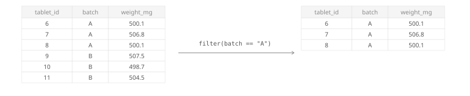
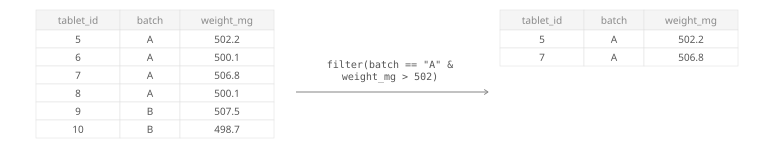




<div class="source-links">
<a class="source-link" href="https://dplyr.tidyverse.org/reference/filter.html" target="_blank" rel="noopener">Original Documentation ↗</a>
<a class="source-link" href="https://rstudio.github.io/cheatsheets/html/data-transformation.html" target="_blank" rel="noopener">dplyr Cheatsheet ↗</a>
</div>

## Required Library
```r
install.packages("tidyverse")
library(tidyverse)
```

## Syntax

```r
# Pipe style
df %>% filter(condition)

# Non-pipe style
filter(df, condition)
```
::: {.desc-item}
`df %>% filter(condition)` and `filter(df, condition)` return only the rows where the condition is `TRUE`.
Rows where the condition is `FALSE` or `NA` are removed.


:::

::: {.callout-note collapse="true"}
## Common filtering pitfalls
Use `==` to test equality and `%in%` to match several allowed values.
When checking for missing values, use `is.na(x)` instead of `x == NA`.
:::

## Argument Overview
<p class="arg-intro">Required arguments must be included when using a function while optional arguments can be included on demand.</p>

::: {.arg-section}
<div class="collapse-toolbar"><button class="collapse-btn">Expand All</button></div>

<details class="arg-item">
<summary><code>.data</code> <span class="arg-types">data frame | tibble</span> <span class="arg-badge required">Required</span></summary>
<div class="arg-body">
The data frame to filter. In a pipe (`%>%`), this is passed automatically from the left-hand side.

```r
capsules %>% filter(pct_label >= 85)
```

<p class="data-types"><strong>Data Types:</strong> <code>data.frame</code> | <code>tibble</code></p>
</div>
</details>

<details class="arg-item">
<summary><code>...</code> — filtering expressions <span class="arg-types">logical expression(s)</span> <span class="arg-badge required">Required</span></summary>
<div class="arg-body">
One or more logical conditions. Keep rows where every condition is `TRUE`.
Multiple conditions separated by commas behave like `AND`.

```r
filter(capsules, pct_label >= 85, pct_label <= 115)
```


```r
# Keep rows that satisfy multiple conditions
# (all conditions must be TRUE)
df %>% filter(condition1, condition2)

# Keep rows that satisfy at least one of several conditions
# (any condition must be TRUE)
df %>% filter(condition1 | condition2)
```
::: {.desc-item}
Use commas to combine multiple conditions with implicit `AND` logic.
For `OR` logic, combine conditions with `|` inside a single expression.


:::

<p class="data-types"><strong>Data Types:</strong> logical expressions that return <code>TRUE</code>/<code>FALSE</code>/<code>NA</code> per row</p>
</div>
</details>

<details class="arg-item">
<summary><code>.by</code> — group temporarily for this call <span class="arg-types">tidy-select</span> <span class="arg-badge optional">Optional</span></summary>
<div class="arg-body">
Group by selected columns only for this `filter()` call, without creating a permanently grouped data frame.

```r
filter(capsules, weight_mg > mean(weight_mg), .by = batch)
```

<p class="data-types"><strong>Data Types:</strong> column names or tidy-select grouping expression · Default: <code>NULL</code></p>
</div>
</details>

<details class="arg-item">
<summary><code>.preserve</code> — keep original grouping metadata <span class="arg-types">logical</span> <span class="arg-badge optional">Optional</span></summary>
<div class="arg-body">
When filtering an already grouped data frame, controls whether grouping structure is recalculated based on remaining rows.
Most users can keep the default.

```r
filter(grouped_data, value > 0, .preserve = TRUE)
```

<p class="data-types"><strong>Data Types:</strong> <code>logical</code> · Default: <code>FALSE</code></p>
</div>
</details>
:::

## Examples

<div class="example-section">
<div class="collapse-toolbar"><button class="collapse-btn">Expand All</button></div>

<details class="example-item">
<summary>Filter condition on one column</summary>
<div class="example-body">

## Filter rows where weight is outside the 190–210 mg range
```{webr}
library(tidyverse)

# Create a tibble of tablet weights
tablet_weights <- tibble(
  tablet_id = c("T01", "T02", "T03", "T04"),
  weight_mg = c(198.4, 201.2, 185.0, 199.8)
)

# Filter rows where weight is outside the 190–210 mg range
out_of_range <- filter(tablet_weights, weight_mg < 190 | weight_mg > 210)

out_of_range
```

## Filter rows where batch is B01, B03, or B05
```{webr}
library(tidyverse)

# Create a tibble of QC results
qc_results <- tibble(
  batch_id = c("B01", "B01", "B02", "B02"),
  assay_pct = c(99.2, 94.8, 101.1, 97.5)
)

# Filter rows where batch is B01, B03, or B05
selected_batches <- filter(qc_results, batch_id %in% c("B01", "B03", "B05"))

selected_batches
```
</div>
</details>

<details class="example-item">
<summary>Filter condition on multiple columns</summary>
<div class="example-body">

```{webr}
library(tidyverse)

# Create a tibble of QC results
qc_results <- tibble(
  batch_id = c("B01", "B01", "B02", "B02"),
  assay_pct = c(99.2, 94.8, 101.1, 97.5)
)

# Filter rows where batch is B01 and assay is within 95–105%
passing_b01 <- filter(qc_results, batch_id == "B01", assay_pct >= 95, assay_pct <= 105)

passing_b01
```
</div>
</details>


<details class="example-item">
<summary>Filtering with a negated condition</summary>
<div class="example-body">

```{webr}
library(tidyverse)

# Create a tibble of HPLC log results
hplc_log <- tibble(
  sample_id = c("S1", "S2", "S3", "S4"),
  pass_fail = c("pass", "fail", "pass", "fail")
)

# Filter rows where pass_fail is not "fail"
passed_only <- filter(hplc_log, pass_fail != "fail")

passed_only
```
</div>
</details>

<details class="example-item">
<summary>Filtering on missing values</summary>
<div class="example-body">

## Keep rows with missing dissolution readings
```{webr}
library(tidyverse)

# Create a tibble of tablet dissolution results
dissolution <- tibble(
  tablet_id = c("T01", "T02", "T03"),
  pct_dissolved = c(85.2, NA, 91.4)
)

missing_readings <- filter(dissolution, is.na(pct_dissolved))

missing_readings
```

## Keep rows with complete dissolution readings
```{webr}
library(tidyverse)

# Create a tibble of tablet dissolution results
dissolution <- tibble(
  tablet_id = c("T01", "T02", "T03"),
  pct_dissolved = c(85.2, NA, 91.4)
)

complete_readings <- filter(dissolution, !is.na(pct_dissolved))

complete_readings
```
</div>
</details>

</div>
