


<div class="source-links">
<a class="source-link" href="https://ggplot2.tidyverse.org/reference/ggplot.html" target="_blank" rel="noopener">Original Documentation ↗</a>
<a class="source-link" href="https://rstudio.github.io/cheatsheets/html/data-visualization.html" target="_blank" rel="noopener">ggplot2 Cheatsheet ↗</a>
</div>

## Required Library
```r
install.packages("tidyverse")
library(tidyverse)
```

## Syntax

```{r, eval=FALSE}
ggplot(data, aes(x = x_var, y = y_var)) +
    geom_*() # replace with a geom function like geom_point(), geom_line(), geom_bar(), etc.
```
::: {.desc-item}
`ggplot()` builds a plot object from a data set (often a tibble data frame), a coordinate system, and geoms.
The data set is specified in the `data` argument, and the coordinate system is defined by the `aes()` function, where aes stands for aesthetics.
You can add one or more `geom_*()` layers with `+` to draw points, lines, bars, and other marks. Widely used geoms include `geom_point()`, `geom_line()`, `geom_bar()`, and `geom_boxplot()`.


:::

## Argument Overview
<p class="arg-intro">Required arguments must be included when using a function while optional arguments can be included on demand.</p>

::: {.arg-section}
<div class="collapse-toolbar"><button class="collapse-btn">Expand All</button></div>

<details class="arg-item">
<summary><code>data</code> — data frame used for plotting <span class="arg-types">data frame | tibble</span> <span class="arg-badge optional">Optional</span></summary>
<div class="arg-body">
The data frame that contains variables used in the plot. Inside `aes()`, you can refer to variables in the data frame by name.
If omitted, data can be supplied in a later layer (for example inside `geom_point(data = ...)`).

```r
ggplot(data = capsules, aes(x = time_min, y = pct_release))
```

<p class="data-types"><strong>Data Types:</strong> <code>data.frame</code> | <code>tibble</code> · Default: <code>NULL</code></p>
</div>
</details>

<details class="arg-item">
<summary><code>aes() mapping</code> — aesthetic mappings <span class="arg-types">uneval mapping</span> <span class="arg-badge optional">Optional</span></summary>
<div class="arg-body">
Defines how variables map to visual properties like `x`, `y`, `color`, `shape`, `linetype`, or `size`.
Aesthetic mappings connect data variables to visual properties so the appearance changes automatically with the data.

This example maps `x` and `y`, which place the data on the horizontal and vertical axes.
These two mappings are the foundation of most ggplot charts.

```r
ggplot(capsules, aes(x = batch, y = pct_label)) +
  geom_col()
```

This example maps `color` so each batch is drawn in a different color.
Use this when you want to visually separate groups in the same plot.

```r
ggplot(capsules, aes(x = time_min, y = pct_release, color = batch)) +
  geom_line()
```

This example maps `shape`, which gives each group a different point symbol.
Shape is most useful in point-based plots where categories need to stay distinct.

```r
ggplot(capsules, aes(x = batch, y = pct_label, shape = batch)) +
  geom_point()
```

This example maps `linetype`, which changes the pattern of the line for each group.
It is useful when colors are limited or when a plot may be printed in grayscale.

```r
ggplot(capsules, aes(x = time_min, y = pct_release, linetype = batch)) +
  geom_line()
```

This example maps `size`, so larger values are shown with larger points.
Use size mapping when you want the magnitude of a numeric variable to be part of the visual encoding.

```r
ggplot(capsules, aes(x = batch, y = pct_label, size = pct_label)) +
  geom_point()
```

<p class="data-types"><strong>Data Types:</strong> <code>aes()</code> mapping object · Default: <code>aes()</code> (empty mapping)</p>
</div>
</details>

<details class="arg-item">
<summary><code>...</code> — additional parameters in geoms <span class="arg-types">varies</span> <span class="arg-badge optional">Optional</span></summary>
<div class="arg-body">
Additional options are usually set inside the `geom_*()` layers you add after `ggplot()`. This is where you style the marks in the plot, for example by changing line width, point size, transparency, fill, or border color. Use styling within geoms to override global aesthetics set in `ggplot()` for specific layers.

```r
ggplot(capsules, aes(time_min, pct_release)) +
  geom_line(linewidth = 1.2, color = "steelblue") +
  geom_point(size = 2.5, color = "steelblue", alpha = 0.8)
```

<p class="data-types"><strong>Data Types:</strong> varies by use case</p>
</div>
</details>
:::

## Examples

<div class="example-section">
<div class="collapse-toolbar"><button class="collapse-btn">Expand All</button></div>

<details class="example-item">
<summary>Scatter plot</summary>
<div class="example-body">

```{webr}
library(tidyverse)

calibration <- read_csv("data/calibration.csv")

ggplot(calibration, aes(x = conc_ug_ml, y = absorbance)) +
  geom_point(size = 2.8, alpha = 0.9) +
  labs(
    title = "Ibuprofen UV calibration",
    x = "Concentration (µg/mL)",
    y = "Absorbance (AU)"
  ) +
  theme_minimal()
```
</div>
</details>

<details class="example-item">
<summary>Line plot</summary>
<div class="example-body">

```{webr}
library(tidyverse)

dissolution <- read_csv("data/dissolution.csv")

ggplot(dissolution, aes(x = time_min, y = pct_dissolved, group = tablet_id)) +
  geom_line(linewidth = 1) +
  geom_point(size = 2) +
  labs(
    title = "Dissolution profiles",
    x = "Time (min)",
    y = "% released"
  ) +
  theme_minimal()
```
</div>
</details>

<details class="example-item">
<summary>Boxplot</summary>
<div class="example-body">

```{webr}
library(tidyverse)

tablet_weights <- read_csv("data/tablet_weights.csv")

ggplot(tablet_weights, aes(x = batch, y = weight_mg, fill = batch)) +
  geom_boxplot(alpha = 0.8, width = 0.65, outlier.shape = 16, outlier.size = 2) +
  guides(fill = "none") +
  labs(
    title = "Tablet weight by batch",
    x = "Batch",
    y = "Weight (mg)"
  ) +
  theme_minimal()
```
</div>
</details>

</div>
