<div class="source-links">
<a class="source-link" href="https://dplyr.tidyverse.org/reference/group_by.html" target="_blank" rel="noopener">Original Documentation ↗</a>
<a class="source-link" href="https://rstudio.github.io/cheatsheets/html/data-transformation.html" target="_blank" rel="noopener">dplyr Cheatsheet ↗</a>
</div>

## Required Library
```r
install.packages("tidyverse")
library(tidyverse)
```

## Syntax

```{r, eval=FALSE}
# Pipe style
df %>% group_by(group_col)

# Non-pipe style
group_by(df, group_col)
```
::: {.desc-item}
`df %>% group_by(group_col)` and `group_by(df, group_col)` create a grouped data frame, so later dplyr verbs can work within each group instead of across the full data set.


:::

```{r, eval=FALSE}
df %>%
  group_by(group_col1, group_col2)
```
::: {.desc-item}
Use more than one grouping variable when you want summaries or calculations split by a combination of categories.
:::

::: {.callout-tip collapse="true"}
## Why group first?
`group_by()` does not change the values in your data frame. It adds grouping metadata that tells `summarise()`, `mutate()`, `filter()`, and related verbs to operate within each group.
:::

::: {.callout-note collapse="true"}
## When and how to ungroup
Use `ungroup()` when you want to remove grouping from a data frame and return to normal whole-table behavior. If you are summarising and want the result to come back ungrouped right away, set `.groups = "drop"` inside `summarise()`.

Why this matters: once a data frame is grouped, later dplyr verbs keep working within each group until you remove the grouping. Ungrouping helps prevent unexpected grouped calculations and makes it easier to pass the result into plotting, exporting, or later analysis steps.
:::

## Argument Overview
<p class="arg-intro">Required arguments must be included when using a function while optional arguments can be included on demand.</p>

::: {.arg-section}
<div class="collapse-toolbar"><button class="collapse-btn">Expand All</button></div>

<details class="arg-item">
<summary><code>.data</code> <span class="arg-types">data frame | tibble</span> <span class="arg-badge required">Required</span></summary>
<div class="arg-body">
The data frame to group. In a pipe (`%>%`), this is passed automatically from the left-hand side — you do not write it explicitly.

```r
capsules %>% group_by(batch)
```

<p class="data-types"><strong>Data Types:</strong> <code>data.frame</code> | <code>tibble</code></p>
</div>
</details>

<details class="arg-item">
<summary><code>...</code> — grouping columns <span class="arg-types">name(s)</span> <span class="arg-badge required">Required</span></summary>
<div class="arg-body">
One or more columns to group by. These are usually column names, but you can also use expressions that evaluate to grouping variables.

```r
group_by(capsules, batch)
group_by(capsules, batch, dose_mg)
```

<p class="data-types"><strong>Data Types:</strong> column names or tidy-select style grouping expressions</p>
</div>
</details>

<details class="arg-item">
<summary><code>.add</code> — add to existing groups <span class="arg-types">logical</span> <span class="arg-badge optional">Optional</span></summary>
<div class="arg-body">
If `FALSE` (default), the new grouping columns replace any existing grouping. If `TRUE`, the new grouping columns are added to the current groups.

```r
group_by(capsules, batch, .add = TRUE)
```

<p class="data-types"><strong>Data Types:</strong> <code>logical</code> · Default: <code>FALSE</code></p>
</div>
</details>

<details class="arg-item">
<summary><code>.drop</code> — drop empty groups <span class="arg-types">logical</span> <span class="arg-badge optional">Optional</span></summary>
<div class="arg-body">
Controls whether factor levels with no rows are kept in the grouping structure. The default is usually `TRUE`.

```r
group_by(capsules, batch, .drop = FALSE)
```

<p class="data-types"><strong>Data Types:</strong> <code>logical</code> · Default: <code>TRUE</code> for most data</p>
</div>
</details>
:::

## Examples

<div class="example-section">
<div class="collapse-toolbar"><button class="collapse-btn">Expand All</button></div>

<details class="example-item">
<summary>Summarise data by group</summary>
<div class="example-body">
Use `group_by()` before `summarise()` to calculate statistics separately for each group.

```{webr-r}
library(tidyverse)

capsules <- tibble(
  batch = c("A", "A", "A", "B", "B", "B"),
  tablet_id = 1:6,
  weight_mg = c(498, 501, 499, 503, 502, 500)
)

batch_summary <- capsules %>%
  group_by(batch) %>%
  summarise(
    n = n(),
    mean_weight_mg = mean(weight_mg),
    .groups = "drop"
  )

batch_summary
```
</div>
</details>

<details class="example-item">
<summary>Use grouped data, then return to an ungrouped data frame</summary>
<div class="example-body">
After grouping, you can do grouped calculations and then remove the grouping with `ungroup()` when you no longer need it.

```{webr-r}
library(tidyverse)

capsules <- tibble(
  batch = c("A", "A", "A", "B", "B", "B"),
  weight_mg = c(498, 501, 499, 503, 502, 500)
)

capsules_grouped <- capsules %>%
  group_by(batch) %>%
  mutate(
    batch_mean = mean(weight_mg),
    deviation = weight_mg - batch_mean
  )

capsules_ungrouped <- capsules_grouped %>%
  ungroup()

capsules_ungrouped
```
</div>
</details>

<details class="example-item">
<summary>Group by more than one variable</summary>
<div class="example-body">
Use multiple grouping columns when summaries need to be split by a combination of categories.

```{webr-r}
library(tidyverse)

results <- tibble(
  batch = c("A", "A", "A", "B", "B", "B"),
  time_min = c(5, 5, 10, 5, 10, 10),
  absorbance = c(0.12, 0.15, 0.31, 0.20, 0.33, 0.35)
)

results_summary <- results %>%
  group_by(batch, time_min) %>%
  summarise(mean_absorbance = mean(absorbance), .groups = "drop")

results_summary
```
</div>
</details>

</div>