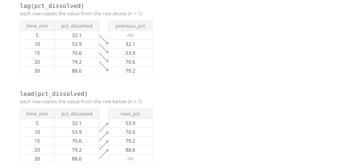




<div class="source-links">
<a class="source-link" href="https://dplyr.tidyverse.org/reference/lead-lag.html" target="_blank" rel="noopener">Original Documentation ↗</a>
<a class="source-link" href="https://rstudio.github.io/cheatsheets/html/data-transformation.html" target="_blank" rel="noopener">dplyr Cheatsheet ↗</a>
</div>

## Required Library
```r
install.packages("tidyverse")
library(tidyverse)
```

## Syntax

`lag()` and `lead()` work on a vector — usually a data frame column referenced inside
`mutate()`, so the shifted result is stored back as a new column.

{width=100%}

```{r, eval=FALSE}
lag(x, n = 1)
```

::: {.desc-item}
`lag(x)` shifts a column's values **backward**: each row gets the value from `n` rows before it.
The first `n` rows have nothing to look back to, so they become `NA`.
:::

```{r, eval=FALSE}
lead(x, n = 1)
```

::: {.desc-item}
`lead(x)` shifts a column's values **forward**: each row gets the value from `n` rows after it.
The last `n` rows have nothing to look ahead to, so they become `NA`.
:::


::: {.callout-tip collapse="true"}
## When do you use `lag()` / `lead()`?
Use `lag()` and `lead()` inside `mutate()` when you need to compare a row to its neighbor —
for example the change since the previous timepoint. Both depend on **row order**, not on values, so `arrange()` your data first.
:::

## Examples

<div class="example-section">
<div class="collapse-toolbar"><button class="collapse-btn">Expand All</button></div>

<details class="example-item">
<summary>Add the previous value with <code>lag()</code></summary>
<div class="example-body">

```{webr}
library(tidyverse)

dissolution <- read_csv("data/dissolution.csv")

dissolution %>%
  group_by(tablet_id) %>%
  arrange(time_min, .by_group = TRUE) %>%
  mutate(previous_pct = lag(pct_dissolved))
```
</div>
</details>

<details class="example-item">
<summary>Compute the change since the previous timepoint</summary>
<div class="example-body">
Subtracting `lag()` from the current value gives the change between consecutive
dissolution readings — the realistic use case for `lag()`.

```{webr}
library(tidyverse)

dissolution <- read_csv("data/dissolution.csv")

dissolution %>%
  group_by(tablet_id) %>%
  arrange(time_min, .by_group = TRUE) %>%
  mutate(pct_change = pct_dissolved - lag(pct_dissolved))
```
</div>
</details>

<details class="example-item">
<summary>Add the next value with <code>lead()</code></summary>
<div class="example-body">
`lead()` mirrors `lag()`, looking forward instead of backward.

```{webr}
library(tidyverse)

dissolution <- read_csv("data/dissolution.csv")

dissolution %>%
  group_by(tablet_id) %>%
  arrange(time_min, .by_group = TRUE) %>%
  mutate(next_pct = lead(pct_dissolved))
```
</div>
</details>

<details class="example-item">
<summary>Shift by more than one row with <code>n</code></summary>
<div class="example-body">

```{webr}
library(tidyverse)

dissolution <- read_csv("data/dissolution.csv")

dissolution %>%
  group_by(tablet_id) %>%
  arrange(time_min, .by_group = TRUE) %>%
  mutate(pct_two_steps_ago = lag(pct_dissolved, n = 2))
```
</div>
</details>

<details class="example-item">
<summary>Fill the boundary <code>NA</code> with <code>default</code></summary>
<div class="example-body">
The first row of each tablet has no earlier value to look back to, so `lag()` returns `NA` there.
Use `default` to fill that gap instead — here, treating the start of dissolution as 0%.

```{webr}
library(tidyverse)

dissolution <- read_csv("data/dissolution.csv")

dissolution %>%
  group_by(tablet_id) %>%
  arrange(time_min, .by_group = TRUE) %>%
  mutate(previous_pct = lag(pct_dissolved, default = 0))
```
</div>
</details>

</div>

## Argument Overview
<p class="arg-intro">Required arguments must be included when using a function while optional arguments can be included on demand.</p>

::: {.arg-section}
<div class="collapse-toolbar"><button class="collapse-btn">Expand All</button></div>

<details class="arg-item">
<summary><code>x</code> — vector to shift <span class="arg-types">vector</span> <span class="arg-badge required">Required</span></summary>
<div class="arg-body">
The column (or vector) whose values should be shifted. Almost always used inside `mutate()`.

```r
dissolution %>% mutate(previous_pct = lag(pct_dissolved))
```

<p class="data-types"><strong>Data Types:</strong> any vector type</p>
</div>
</details>

<details class="arg-item">
<summary><code>n</code> — number of positions to shift <span class="arg-types">integer</span> <span class="arg-badge optional">Optional</span></summary>
<div class="arg-body">
How many rows to look back (`lag()`) or ahead (`lead()`). Default is `1`, meaning "the immediately previous/next row".

```r
dissolution %>% mutate(pct_two_steps_ago = lag(pct_dissolved, n = 2))
```

<p class="data-types"><strong>Data Types:</strong> <code>integer</code> · Default: <code>1</code></p>
</div>
</details>

<details class="arg-item">
<summary><code>default</code> — value for the introduced <code>NA</code> <span class="arg-types">any</span> <span class="arg-badge optional">Optional</span></summary>
<div class="arg-body">
The value used for rows that have no previous/next row to pull from (the start of the data
for `lag()`, the end for `lead()`). Defaults to `NA`.

```r
dissolution %>% mutate(previous_pct = lag(pct_dissolved, default = 0))
```

<p class="data-types"><strong>Data Types:</strong> same type as <code>x</code> · Default: <code>NA</code></p>
</div>
</details>

<details class="arg-item">
<summary><code>order_by</code> — column defining the shift order <span class="arg-types">column name</span> <span class="arg-badge optional">Optional</span></summary>
<div class="arg-body">
By default, `lag()`/`lead()` shift by current row order. If the data isn't already arranged
the way you need, pass a column here instead of arranging first.

```r
dissolution %>% mutate(previous_pct = lag(pct_dissolved, order_by = time_min))
```

<p class="data-types"><strong>Data Types:</strong> column name · Default: <code>NULL</code> (uses row order)</p>
</div>
</details>
:::
