<div class="source-links">
<a class="source-link" href="https://readr.tidyverse.org/reference/read_delim.html" target="_blank" rel="noopener">Original Documentation ↗</a>
<a class="source-link" href="https://rstudio.github.io/cheatsheets/html/data-import.html" target="_blank" rel="noopener">readr Cheatsheet ↗</a>
</div>




## Required Library
```r
install.packages("tidyverse")
library(tidyverse)
```

## Syntax

```{r, eval=FALSE}
read_csv(file)
```
::: {.desc-item}
`read_csv("file_name.csv")` reads a comma-separated values (.csv) file and returns a [tibble](tibble.qmd) data frame. Use if your file uses commas as column separators and dots for decimals.


:::

<hr>

```{r, eval=FALSE}
read_csv2(file)
```
::: {.desc-item}
`read_csv2("file_name.csv")` reads a .csv file that uses semicolons as column separators and commas for decimals. Note that the created tibble data frame uses dots for decimals.


:::

::: {.callout-tip collapse="true"}
## Why 2 different functions?
English standard vs. danish standard for writing decimals. To find out how your `.csv`file is formatted, open it with a text editor on your computer or use the following code to print the first rows with R: `read_lines("file.csv", n_max = 3)`

## English standard: `1.23, 4.56, 7.89`
```{webr}
read_lines("data/dissolution.csv", n_max = 3)
```

## Danish standard: `1,23; 4,56; 7,89`
```{webr}
read_lines("data/dissolution_dk.csv", n_max = 3)
```
:::

## Argument Overview
<p class="arg-intro">Required arguments must be included when using a function while optional arguments can be included on demand.</p>

::: {.arg-section}
<div class="collapse-toolbar"><button class="collapse-btn">Expand All</button></div>

<details class="arg-item">
<summary><code>file</code> — path to the CSV file <span class="arg-types">character | connection</span> <span class="arg-badge required">Required</span></summary>
<div class="arg-body">
A string giving the path to the CSV file.
Use forward slashes (`/`) in file paths, even on Windows.

```r
read_csv("data/capsule_weights.csv")              # relative path from working directory
read_csv("C:/Users/Morten/Documents/data.csv")    # absolute path on your computer
```

<p class="data-types"><strong>Data Types:</strong> <code>character</code> (file path or URL) | <code>connection</code> | <code>I(text)</code></p>
</div>
</details>

<details class="arg-item">
<summary><code>col_names</code> — use first row as column names <span class="arg-types">logical | character</span> <span class="arg-badge optional">Optional</span></summary>
<div class="arg-body">
If `TRUE` (default), the first row is used as column names. If `FALSE`, column names are generated automatically (`X1`, `X2`, …). You can also supply a character vector to set names directly.

```r
read_csv("data.csv", col_names = FALSE)
read_csv("data.csv", col_names = c("id", "dose", "response"))
```

<p class="data-types"><strong>Data Types:</strong> <code>logical</code> | <code>character</code> vector · Default: <code>TRUE</code></p>
</div>
</details>

<details class="arg-item">
<summary><code>col_select</code> — select columns to read <span class="arg-types">tidy-select</span> <span class="arg-badge optional">Optional</span></summary>
<div class="arg-body">
Read only a subset of columns. Accepts tidy-select syntax — column names, ranges, or helper functions like `starts_with()`.

```r
read_csv("data.csv", col_select = c(id, dose, response))
read_csv("data.csv", col_select = starts_with("conc"))
```

<p class="data-types"><strong>Data Types:</strong> tidy-select expression · Default: <code>NULL</code> (all columns)</p>
</div>
</details>


<details class="arg-item">
<summary><code>na</code> — strings to interpret as missing <span class="arg-types">character vector</span> <span class="arg-badge optional">Optional</span></summary>
<div class="arg-body">
A character vector of strings that should be converted to `NA` when reading.
Default is `c("", "NA")`.
Extend this when your data uses other missing value codes.

```r
read_csv("data.csv", na = c("", "NA", "N/A", "ND", "Missing", "."))
```

<p class="data-types"><strong>Data Types:</strong> <code>character</code> vector · Default: <code>c("", "NA")</code></p>
</div>
</details>


<details class="arg-item">
<summary><code>comment</code> — comment character <span class="arg-types">character</span> <span class="arg-badge optional">Optional</span></summary>
<div class="arg-body">
Any text after this character on a line is ignored. Useful for files that contain comment lines starting with `#`.

```r
read_csv("data.csv", comment = "#")
```

<p class="data-types"><strong>Data Types:</strong> single <code>character</code> · Default: <code>""</code> (no comments)</p>
</div>
</details>

<details class="arg-item">
<summary><code>trim_ws</code> — trim whitespace from fields <span class="arg-types">logical</span> <span class="arg-badge optional">Optional</span></summary>
<div class="arg-body">
If `TRUE` (default), leading and trailing whitespace is stripped from each field before parsing.

```r
read_csv("data.csv", trim_ws = FALSE)
```

<p class="data-types"><strong>Data Types:</strong> <code>logical</code> · Default: <code>TRUE</code></p>
</div>
</details>

<details class="arg-item">
<summary><code>skip</code> — rows to skip at the top <span class="arg-types">integer</span> <span class="arg-badge optional">Optional</span></summary>
<div class="arg-body">
Number of lines to skip before reading the header row.
Useful when CSV files exported from instruments contain metadata rows above the column names.

```r
read_csv("instrument_export.csv", skip = 5)   # skip 5 metadata rows
```

<p class="data-types"><strong>Data Types:</strong> <code>integer</code> · Default: <code>0</code></p>
</div>
</details>

<details class="arg-item">
<summary><code>n_max</code> — maximum number of rows to read <span class="arg-types">numeric</span> <span class="arg-badge optional">Optional</span></summary>
<div class="arg-body">
Stop reading after this many data rows (not counting the header).
Useful for previewing a large file or reading only a subset.

```r
read_csv("large_dataset.csv", n_max = 100)   # first 100 rows only
```

<p class="data-types"><strong>Data Types:</strong> <code>numeric</code> · Default: <code>Inf</code> (read all rows)</p>
</div>
</details>

<details class="arg-item">
<summary><code>name_repair</code> — strategy for duplicate or invalid column names <span class="arg-types">character | function</span> <span class="arg-badge optional">Optional</span></summary>
<div class="arg-body">
How to handle column names that are duplicated or syntactically invalid. Common options: `"unique"` (default), `"minimal"`, `"universal"`, or a custom function.

```r
read_csv("data.csv", name_repair = "universal")
```

<p class="data-types"><strong>Data Types:</strong> <code>character</code> | <code>function</code> · Default: <code>"unique"</code></p>
</div>
</details>

<details class="arg-item">
<summary><code>skip_empty_rows</code> — skip blank rows <span class="arg-types">logical</span> <span class="arg-badge optional">Optional</span></summary>
<div class="arg-body">
If `TRUE` (default), completely empty rows are ignored. Set to `FALSE` to preserve them as rows of `NA`.

```r
read_csv("data.csv", skip_empty_rows = FALSE)
```

<p class="data-types"><strong>Data Types:</strong> <code>logical</code> · Default: <code>TRUE</code></p>
</div>
</details>

:::

## Examples
<a class="source-link" href="../data/dissolution_data_raw.csv" target="_blank" rel="noopener">Example File (.csv) ↗</a>

<div class="example-section">
<div class="collapse-toolbar"><button class="collapse-btn">Expand All</button></div>

<details class="example-item">
<summary>Read a CSV file from your computer</summary>
<div class="example-body">

## English CSV standard
```{webr}
library(tidyverse)

data <- read_csv("data/dissolution.csv")

head(data)
```

## Danish CSV standard
```{webr}
library(tidyverse)

data <- read_csv2("data/dissolution_dk.csv")

head(data)
```
</div>
</details>

<details class="example-item">
<summary>Select Columns</summary>
<div class="example-body">

## Read one column selected by name
```{webr}
library(tidyverse)

data <- read_csv("data/dissolution.csv", col_select = pct_dissolved)

head(data)
```

## Read multiple columns selected by name
```{webr}
library(tidyverse)

data <- read_csv("data/dissolution.csv", col_select = c(tablet_id,pct_dissolved))

head(data)
```
</div>
</details>

<details class="example-item">
<summary>Limit the number of rows read</summary>
<div class="example-body">
Useful for previewing a large dataset without loading the whole thing.


```{webr}
library(tidyverse)

data <- read_csv("data/dissolution.csv", n_max = 5)

head(data)
```

</div>
</details>

<details class="example-item">
<summary>Skip lines from the top</summary>
<div class="example-body">
Useful if the file has metadata rows above the header row. The example will skip the first 2 lines.

```{webr}
library(tidyverse)

data <- read_csv("data/weights_export.csv", skip = 3)

head(data)
```

</div>
</details>

<details class="example-item">
<summary>Handle Missing Values</summary>
<div class="example-body">
 Missing values that were entered in the spreadsheet as `"N/A"`, `"-"`, and `"ND"` can be converted to `NA` during import by specifying them in the `na` argument:

```{webr}
library(tidyverse)

data <- read_csv("data/weights_export.csv", na = c("", "NA", "N/A", "-"))

head(data)
```

</div>
</details>

<details class="example-item">
<summary>Set your own column names</summary>
<div class="example-body">
If a file has no header row, or you want clearer column names than the original file provides, supply a character vector to `col_names`. Make sure the order matches the columns in the file, and use `skip` to skip over the original header row, so they aren't read as data.

## Original column names: `tablet_id`, `time_min`, `pct_dissolved`
```{webr}
library(tidyverse)

df_named <- read_csv(
  "data/dissolution.csv"
)

head(df_named)
```

## Set your own column names and skip the original header row:
```{webr}
library(tidyverse)

df_named <- read_csv(
  "data/dissolution.csv",
  col_names = c("id", "time", "dilution_factor"),
  skip = 1
)

head(df_named)
```
</div>
</details>

</div>
