


<div class="source-links">
<a class="source-link" href="https://dplyr.tidyverse.org/reference/summarise.html" target="_blank" rel="noopener">Original Documentation ↗</a>
<a class="source-link" href="https://rstudio.github.io/cheatsheets/html/data-transformation.html" target="_blank" rel="noopener">dplyr Cheatsheet ↗</a>
</div>

## Required Library
```r
install.packages("tidyverse")
library(tidyverse)
```

## Syntax

```{r, eval=FALSE}
# Pipe style
df %>% summarise(new_summary = expression)

# Non-pipe style
summarise(df, new_summary = expression)
```
::: {.desc-item}
`df %>% summarise(new_summary = expression)` and `summarise(df, new_summary = expression)` collapse a data frame down to summary values, such as means, medians, counts, or standard deviations.



::: {.callout-tip collapse="true"}
## Why use summarise?
`summarise()` is the standard dplyr verb for reducing many rows into fewer rows. It is commonly used after `group_by()` to produce batch means, subgroup counts, and other compact summary tables.
:::

When the input is grouped, `summarise()` returns one row per group.
:::

```{r, eval=FALSE}
df %>%
  group_by(group_col) %>%
  summarise(mean_value = mean(value))
```
::: {.desc-item}
Use `group_by()` first when you want separate summaries for each category.
:::

::: {.callout-note collapse="true"}
## Ungroup after summarising?
By default, grouped summaries may stay grouped depending on the result structure. If you want an ungrouped result immediately, set `.groups = "drop"` inside `summarise()`. You can also use `ungroup()` after the summary step if you need to remove grouping later.
:::

## Examples

<div class="example-section">
<div class="collapse-toolbar"><button class="collapse-btn">Expand All</button></div>

<details class="example-item">
<summary>Summarise an entire data set</summary>
<div class="example-body">
Use `summarise()` by itself when you want a single summary row for the whole table.

```{webr}
library(tidyverse)

capsules <- tibble(
  weight_mg = c(498, 501, 499, 503, 502, 500),
  absorbance = c(0.149, 0.153, 0.145, 0.160, 0.157, 0.151)
)

capsule_summary <- capsules %>%
  summarise(
    mean_weight_mg = mean(weight_mg),
    sd_weight_mg = sd(weight_mg),
    mean_absorbance = mean(absorbance)
  )

capsule_summary
```
</div>
</details>

<details class="example-item">
<summary>Summarise by group</summary>
<div class="example-body">
Combine `group_by()` and `summarise()` to compare batches side by side.

```{webr}
library(tidyverse)

capsules <- tibble(
  batch = c("A", "A", "A", "B", "B", "B"),
  weight_mg = c(498, 501, 499, 503, 502, 500)
)

batch_summary <- capsules %>%
  group_by(batch) %>%
  summarise(
    n = n(),
    mean_weight_mg = mean(weight_mg),
    sd_weight_mg = sd(weight_mg),
    .groups = "drop"
  )

batch_summary
```
</div>
</details>

<details class="example-item">
<summary>Use `.by` for a one-off grouped summary</summary>
<div class="example-body">
If you only need grouping for one operation, `.by` can be a compact alternative to `group_by()`.

```{webr}
library(tidyverse)

capsules <- tibble(
  batch = c("A", "A", "A", "B", "B", "B"),
  weight_mg = c(498, 501, 499, 503, 502, 500)
)

capsules %>% 
summarise(
  mean_weight_mg = mean(weight_mg),
  .by = batch
)
```
</div>
</details>

</div>

## Argument Overview
<p class="arg-intro">Required arguments must be included when using a function while optional arguments can be included on demand.</p>

::: {.arg-section}
<div class="collapse-toolbar"><button class="collapse-btn">Expand All</button></div>

<details class="arg-item">
<summary><code>.data</code> <span class="arg-types">data frame | tibble</span> <span class="arg-badge required">Required</span></summary>
<div class="arg-body">
The data frame to summarise. In a pipe, this is passed automatically from the left-hand side — you do not write it explicitly.

```r
capsules %>% summarise(mean_weight_mg = mean(weight_mg))
```

<p class="data-types"><strong>Data Types:</strong> <code>data.frame</code> | <code>tibble</code></p>
</div>
</details>

<details class="arg-item">
<summary><code>...</code> — name–expression pairs <span class="arg-types">name = expr</span> <span class="arg-badge required">Required</span></summary>
<div class="arg-body">
One or more summary expressions of the form `new_name = expression`. Each expression should produce a single value per group, or a single value for the whole data frame.

```r
summarise(
  mean_weight_mg = mean(weight_mg),
  sd_weight_mg = sd(weight_mg),
  n = n()
)
```

<p class="data-types"><strong>Data Types:</strong> summary expressions that return one value per group</p>
</div>
</details>

<details class="arg-item">
<summary><code>.by</code> — group temporarily for this call <span class="arg-types">tidy-select</span> <span class="arg-badge optional">Optional</span></summary>
<div class="arg-body">
Group by selected columns just for this `summarise()` call, without creating a permanently grouped data frame first.

```r
summarise(capsules, mean_weight_mg = mean(weight_mg), .by = batch)
```

<p class="data-types"><strong>Data Types:</strong> column names or tidy-select grouping expression · Default: <code>NULL</code></p>
</div>
</details>

<details class="arg-item">
<summary><code>.groups</code> — control grouping in the result <span class="arg-types">character</span> <span class="arg-badge optional">Optional</span></summary>
<div class="arg-body">
Controls how grouping is handled after summarising. Common values are `"drop"` to return an ungrouped result and `"keep"` to preserve grouping.

```r
summarise(capsules, mean_weight_mg = mean(weight_mg), .groups = "drop")
```

<p class="data-types"><strong>Data Types:</strong> <code>character</code> · Default: chosen automatically by dplyr</p>
</div>
</details>
:::
