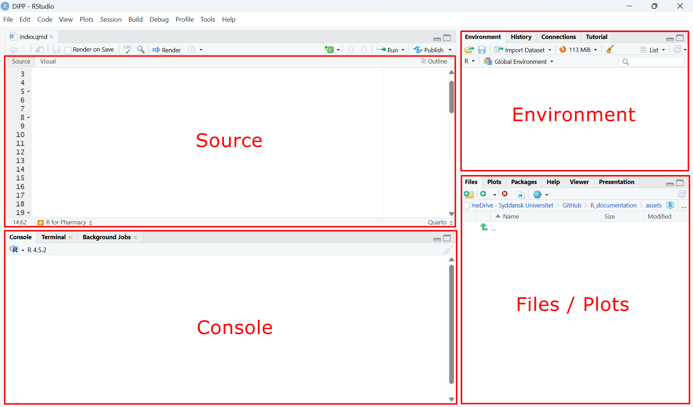

## What you need

To follow along locally you need two free pieces of software:

-   **R** — the language itself. Download from [cran.r-project.org](https://cran.r-project.org).
-   **RStudio** — the editor. Download from [posit.co/download/rstudio-desktop](https://posit.co/download/rstudio-desktop).

Install R first, then RStudio.

::: callout-tip
## No installation needed on this site

Every code block on this site runs live in your browser via [webR](https://webr.r-wasm.org). Click **Run Code** to execute — no R or RStudio required.
:::

------------------------------------------------------------------------

## The RStudio interface

When you open RStudio you will see four panes:

| Pane | Purpose |
|------------------------------------|------------------------------------|
| **Source** (top-left) | Write and save R scripts (`.R` files) |
| **Console** (bottom-left) | Run code interactively and see output |
| **Environment** (top-right) | See all objects currently in memory |
| **Files / Plots** (bottom-right) | Browse files, view plots, read help pages |



------------------------------------------------------------------------

## Your first lines of R

Try running these in the console (or click **Run Code** below):

```{webr-r}
# Arithmetic
dose_mg <- 500
weight_kg <- 70
dose_per_kg <- dose_mg / weight_kg
cat("Dose per kg:", signif(dose_per_kg, 3), "mg/kg\n")
```

------------------------------------------------------------------------

## Installing packages

The tidyverse packages used throughout this site can be installed once with:

``` r
install.packages(c("dplyr", "readr", "tibble", "ggplot2"))
```

Then load them at the top of each script:

``` r
library(dplyr)
library(readr)
library(tibble)
```

::: callout-note
Packages only need to be **installed** once, but must be **loaded** (`library()`) in every new R session.
:::

------------------------------------------------------------------------

## Next steps

-   Browse the [function reference](functions/index.qmd) to see what's covered.
-   Open any function page and click **Run Code** to try examples interactively.
