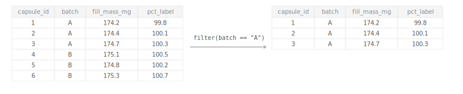
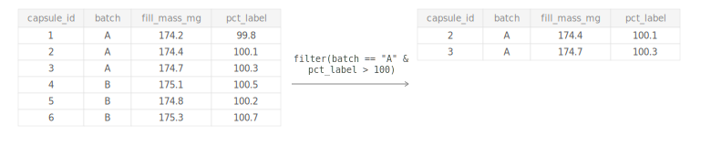
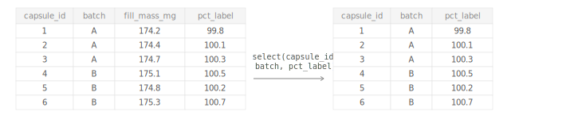
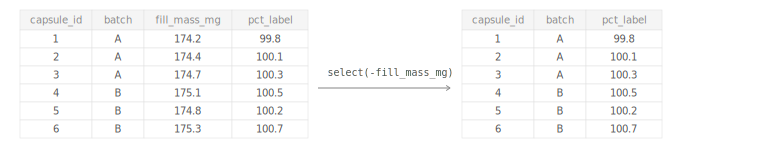
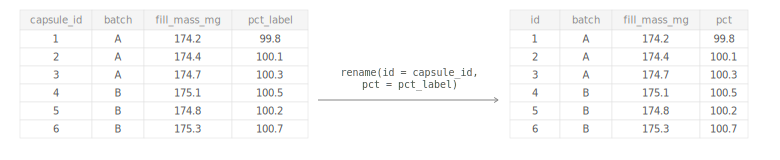
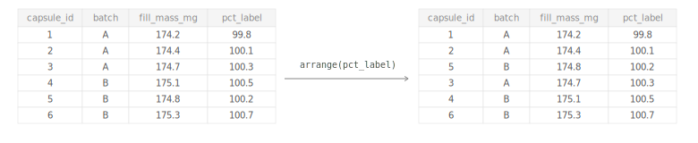
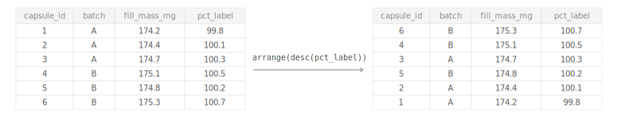
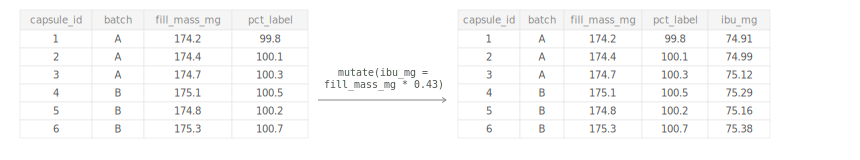
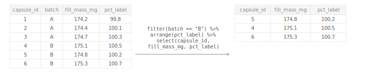

<details class="topic-card" open>
<summary>Load the Data</summary>
<div class="topic-card-body">

First, you have to load the data.

```{webr-r}
library(tidyverse)
#library(dplyr)
#library(tibble)

capsules <- read_csv("/home/web_user/capsules.csv")

capsules
```

Because webR cells run in separate scopes (meaning one cell does not know what the other cell knows), each example chunk below loads what it needs on its own.

</div>
</details>

<details class="topic-card">
<summary>filter( )</summary>
<div class="topic-card-body">

Keep only rows where a condition is `TRUE`.

## Filter based on one condition

```{webr-r}
# Keep only batch A capsules
library(tidyverse)
capsules <- read_csv("/home/web_user/capsules.csv")

capsules %>%
  filter(batch == "A")
```

{width=100%}

## Filter based on multiple conditions

```{webr-r}
# Keep rows matching two conditions
library(tidyverse)
capsules <- read_csv("/home/web_user/capsules.csv")

capsules %>%
  filter(batch == "A" & pct_label > 100)
```

{width=100%}

::: {.callout-tip}
## Available Operators

- `==` **equal** — is the value exactly this?
- `!=` **not equal** — exclude this value
- `>` / `<` **greater / less than** — strictly above or below
- `>=` / `<=` **greater / less than or equal** — includes the boundary value
- `&` **and** — both conditions must be true
- `|` **or** — at least one condition must be true
:::

</div>
</details>

<details class="topic-card">
<summary>select( )</summary>
<div class="topic-card-body">

Keep only the columns you need.

## Select columns by name

```{webr-r}
library(tidyverse)
capsules <- read_csv("/home/web_user/capsules.csv")

capsules %>%
  select(capsule_id, batch, pct_label)
```

{width=100%}

## Drop a column by name

```{webr-r}
# Drop a column with -
library(tidyverse)
capsules <- read_csv("/home/web_user/capsules.csv")

capsules %>%
  select(-fill_mass_mg)
```

{width=100%}

</div>
</details>

<details class="topic-card">
<summary>rename( )</summary>
<div class="topic-card-body">

Rename a column: `rename(new_name = old_name)`.

```{webr-r}
library(tidyverse)
capsules <- read_csv("/home/web_user/capsules.csv")

capsules %>%
  rename(id = capsule_id, pct = pct_label)
```

{width=100%}

</div>
</details>

<details class="topic-card">
<summary>arrange( )</summary>
<div class="topic-card-body">

Sort rows by a column.

##  Ascending order
```{webr-r}
library(tidyverse)
capsules <- read_csv("/home/web_user/capsules.csv")

capsules %>%
  arrange(pct_label)
```

{width=100%}

## Descending order

```{webr-r}
library(tidyverse)
capsules <- read_csv("/home/web_user/capsules.csv")

capsules %>%
  arrange(desc(pct_label))
```

{width=100%}

</div>
</details>

<details class="topic-card">
<summary>mutate( )</summary>
<div class="topic-card-body">

Add or transform columns. See the full [`mutate()` reference page](../functions/mutate.qmd) for details.

```{webr-r}
library(tidyverse)
capsules <- read_csv("/home/web_user/capsules.csv")

capsules %>%
  mutate(ibu_mg = fill_mass_mg * 0.43) #%>%
  #select(capsule_id, fill_mass_mg, ibu_mg, pct_label)
```

{width=100%}

</div>
</details>

<details class="topic-card">
<summary>Combining steps</summary>
<div class="topic-card-body">

Chain any number of operations with the pipe — each result flows into the next.

```{webr-r}
library(tidyverse)
capsules <- read_csv("/home/web_user/capsules.csv")

capsules %>%
  filter(batch == "B") %>%
  arrange(pct_label) %>%
  select(capsule_id, fill_mass_mg, pct_label)
```

{width=100%}

</div>
</details>
