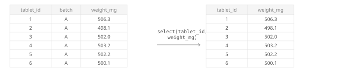
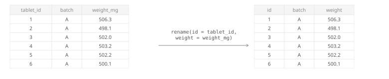
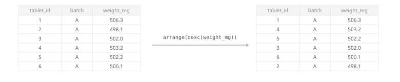
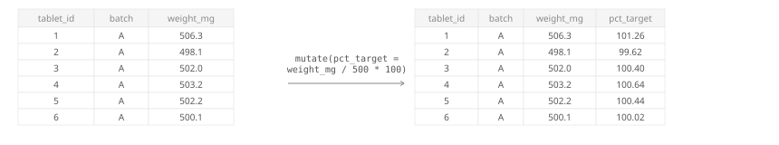
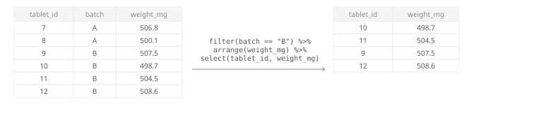




<details class="topic-card" open>
<summary>Load the Data</summary>
<div class="topic-card-body">

First, you have to load the data.

```{webr}
library(tidyverse)

tablet_weights <- read_csv("data/tablet_weights.csv")

tablet_weights
```

</div>
</details>

<details class="topic-card">
<summary>filter( )</summary>
<div class="topic-card-body">

Keep only rows where a condition is `TRUE`.

## Filter based on one condition

```{webr}
# Keep only batch A tablets
library(tidyverse)
tablet_weights <- read_csv("data/tablet_weights.csv")

tablet_weights %>%
  filter(batch == "A")
```

{width=100%}

## Filter based on multiple conditions

```{webr}
# Keep rows matching two conditions
library(tidyverse)
tablet_weights <- read_csv("data/tablet_weights.csv")

tablet_weights %>%
  filter(batch == "A" & weight_mg > 502)
```

{width=100%}

::: {.callout-tip}
## Available Operators

- `==` **equal** — is the value exactly this?
- `!=` **not equal** — exclude this value
- `>` / `<` **greater / less than** — strictly above or below
- `>=` / `<=` **greater / less than or equal** — includes the boundary value
- `&` **and** — both conditions must be true
- `|` **or** — at least one condition must be true
:::

</div>
</details>

<details class="topic-card">
<summary>select( )</summary>
<div class="topic-card-body">

Keep only the columns you need.

## Select columns by name

```{webr}
library(tidyverse)
tablet_weights <- read_csv("data/tablet_weights.csv")

tablet_weights %>%
  select(tablet_id, weight_mg)
```

{width=100%}

## Drop a column by name

```{webr}
# Drop a column with -
library(tidyverse)
tablet_weights <- read_csv("data/tablet_weights.csv")

tablet_weights %>%
  select(-weight_mg)
```

{width=100%}

</div>
</details>

<details class="topic-card">
<summary>rename( )</summary>
<div class="topic-card-body">

Rename a column: `rename(new_name = old_name)`.

```{webr}
library(tidyverse)
tablet_weights <- read_csv("data/tablet_weights.csv")

tablet_weights %>%
  rename(id = tablet_id, weight = weight_mg)
```

{width=100%}

</div>
</details>

<details class="topic-card">
<summary>arrange( )</summary>
<div class="topic-card-body">

Sort rows by a column.

##  Ascending order
```{webr}
library(tidyverse)
tablet_weights <- read_csv("data/tablet_weights.csv")

tablet_weights %>%
  arrange(weight_mg)
```

{width=100%}

## Descending order

```{webr}
library(tidyverse)
tablet_weights <- read_csv("data/tablet_weights.csv")

tablet_weights %>%
  arrange(desc(weight_mg))
```

{width=100%}

</div>
</details>

<details class="topic-card">
<summary>mutate( )</summary>
<div class="topic-card-body">

Add or transform columns. See the full [`mutate()` reference page](../functions/mutate.qmd) for details.

```{webr}
# The target weight is 500 mg — express each tablet as % of target
library(tidyverse)
tablet_weights <- read_csv("data/tablet_weights.csv")

tablet_weights %>%
  mutate(pct_target = weight_mg / 500 * 100)
```

{width=100%}

</div>
</details>

<details class="topic-card">
<summary>Combining steps</summary>
<div class="topic-card-body">

Chain any number of operations with the pipe — each result flows into the next.

```{webr}
library(tidyverse)
tablet_weights <- read_csv("data/tablet_weights.csv")

tablet_weights %>%
  filter(batch == "B") %>%
  arrange(weight_mg) %>%
  select(tablet_id, weight_mg)
```

{width=100%}

</div>
</details>
