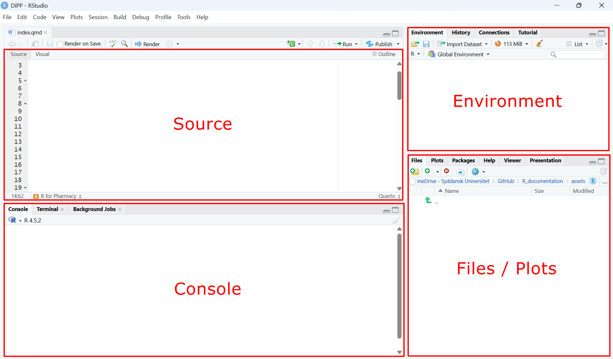




<details class="topic-card" open>
<summary>Installing the R Language and a Development Environment (IDE)</summary>
<div class="topic-card-body">

To follow along locally you need two free pieces of software:

- **R** — the language itself. Download from [cran.r-project.org](https://cran.r-project.org).
- **RStudio** — the editor (IDE). Download from [posit.co/download/rstudio-desktop](https://posit.co/download/rstudio-desktop).

Install R first, then RStudio.

::: {.callout-tip}
## No installation needed on this site
Executable code blocks on this site run live in your browser via [webR](https://webr.r-wasm.org). Click **Run Code** to execute — no R or RStudio required.
:::

### The RStudio interface

When you open RStudio you will see four panes:

| Pane | Purpose |
|---|---|
| **Source** (top-left) | Write and save R scripts (files you write your code in) |
| **Console** (bottom-left) | Run code and see output |
| **Environment** (top-right) | See all objects currently in memory |
| **Files / Plots** (bottom-right) | Browse files, view plots, read help pages |

At first, the **Source** pane may be empty or not visible yet. That is normal: the Source pane shows script files, so you need to create or open one before it appears.

To create your first script, go to **File -> New File -> R Script**. Save it with a meaningful name (for example `my_first_script.R`).

Good beginner habit: write code in the Source pane and run it from there, rather than typing everything directly in the Console. This gives you a saved, reusable record of your work.

To run code from a script:

- Place the cursor on a line (or select multiple lines)
- Press **Ctrl+Enter** (Windows) / **Cmd+Enter** (Mac)
- Read output in the **Console**

As you run code, created objects appear in the **Environment** pane, and plots appear in the **Plots** tab.

[For a detailed explanation watch: RStudio in 3 minutes (YouTube) ↗](https://www.youtube.com/watch?v=GEuuhg7NBko){target="_blank" rel="noopener"}



</div>
</details>

<details class="topic-card">
<summary>Libraries / Packages</summary>
<div class="topic-card-body">

**Packages** are bundles of extra functions that extend what R can do. You download them once from CRAN (R's central repository) and they're stored locally in your **library** folder. The packages used throughout this site are mostly part of the [tidyverse](https://www.tidyverse.org), a set of packages designed for data science.

### Installing packages

Install packages once from CRAN using `install.packages()`.

You install a package when you need functions it provides. Most functions you will need in the beginning are included in the tidyverse, so you can usually just install the tidyverse:

```r
install.packages("tidyverse")
```

You only need to do this once per computer. So instead of writing it in your script and run the install every time you run your script, you can also execute the install in the console.

### Loading packages

At the top of every script, load the packages you need with `library()`. This tells R which installed packages to make available in the current session.

```r
library(tidyverse)
```

::: {.callout-note}
Packages only need to be **installed** once, but must be **loaded** (`library()`) at the start of every new R session.
:::

</div>
</details>

<details class="topic-card">
<summary>Data</summary>
<div class="topic-card-body">
Data is information that a computer can store and work with. It comes in different types — the most common ones you will encounter in R are:

| Type | Example values | R type |
|---|---|---|
| Numbers | `74.2`, `3.14` | `numeric` / `double` |
| Whole numbers | `1`, `6`, `100` | `integer` |
| Text | `"PASS"`, `"batch_01"` | `character` |
| True/False | `TRUE`, `FALSE` | `logical or boolean` |

::: {.callout-note}
In R, decimal numbers use a `.` not a `,` — so three and a half is written `3.5`, not `3,5`.
:::

The type matters because it determines what you can do with a value. You can calculate the average of numbers, but not of text.

In R, even a single value is stored as an object. When you have multiple values of the same type, they form a vector. And when you organize vectors into columns, you get a tibble — a modern version of a data frame with rows (observations) and columns (variables), similar to a table.

You create an object by assigning a value to a name using `<-`. On the left side of `<-` you write the object name. On the right side you write the value you want to store.

## Naming rules:

- Start names with a letter
- Use only letters, numbers, and `_`
- Do not use spaces or special characters like `-`, `/`, `?`, `!`
- Names are case-sensitive (`dose_mg` and `Dose_mg` are different)
- Use descriptive names, ideally with units when relevant (for example `weight_kg`)

## Examples:

- Good: `dose_mg`, `patient_id`, `reaction_time_s`
- Avoid: `dose mg` (space), `2dose` (starts with number), `x` (too vague)

```r
temperature <- 22.5 
capital_city <- "Copenhagen"  
```

Multiple values of the same type can be combined using the `c()` function to form a vector:

```r
cities <- c("Copenhagen", "Aarhus", "Odense")
temperatures <- c(22.5, 19.3, 21.0)
```

And when you organize vectors into columns, you get a tibble. Since a tibble is a function from the tidyverse, remember to load the library:

```r
library(tidyverse)

weather <- tibble(
  city        = cities,
  temperature = temperatures
)
```

::: {.callout-note}
Use clear, consistent naming from the beginning. Prefer `snake_case` (lowercase with `_`) such as `air_temperature` and `dose_mg`.
:::

Data is read into R from files using functions like [`read_csv()`](../functions/read-csv.qmd).

Within RStudio, you can inspect your data objects in the Environment panel, or using

```r
view(name_of_your_object)
```

</div>
</details>

<details class="topic-card">
<summary>Comments</summary>
<div class="topic-card-body">

Lines starting with `#` are comments — R ignores them when running code. Use comments to explain what your code does:

```r
# This is a comment — R will not execute this line
dose_mg <- 500   # you can also add a comment after code
```

</div>
</details>

<details class="topic-card">
<summary>Operations</summary>
<div class="topic-card-body">

An operator is a symbol that performs an action on one or more values. They cover assignment (<-), arithmetic (+, -, etc.), comparison (==, >, etc.), and the pipe (%>%).


### Assignment operator

| Operator | Meaning | Example | Result |
|---|---|---|---|
| `<-` | Assign a value to a name | `x <- 42` | `x` now stores `42` |

### Arithmetic operators

| Operator | Meaning | Example | Result |
|---|---|---|---|
| `+` | Addition | `3 + 2` | `5` |
| `-` | Subtraction | `10 - 4` | `6` |
| `*` | Multiplication | `5 * 3` | `15` |
| `/` | Division | `20 / 4` | `5` |
| `^` | Exponentiation | `2 ^ 3` | `8` |
| `%%` | Modulo (remainder) | `7 %% 3` | `1` |

### Comparison operators

Used to test conditions — return `TRUE` or `FALSE`:

| Operator | Meaning | Example | Result |
|---|---|---|---|
| `==` | Equal to | `5 == 5` | `TRUE` |
| `!=` | Not equal to | `5 != 3` | `TRUE` |
| `>` | Greater than | `7 > 3` | `TRUE` |
| `<` | Less than | `2 < 1` | `FALSE` |
| `>=` | Greater or equal | `5 >= 5` | `TRUE` |
| `<=` | Less or equal | `3 <= 2` | `FALSE` |

### Pipe Operator

The pipe takes the output of one step and passes it as the input to the next — read it as "and then". This allows you to chain multiple operations into a readable sequence without creating intermediate objects.

| Operator | Meaning | Example | Result |
|---|---|---|---|
| `%>%` | Pass result to next function | `data %>% filter(age > 18)` | Filtered data frame containing entries where age is larger than 18 |

</div>
</details>

<details class="topic-card">
<summary>Computation</summary>
<div class="topic-card-body">

In R, data and computation are kept separate. You first store your data in objects, and then write expressions that compute with those objects.
This is different from working in Excel, where data and formulas are mixed together in the same cells. In R, your data stays fixed in its object — computation produces a new object, leaving the original unchanged. 

```r
dose_mg   <- 500      # data
weight_kg <- 70       # data

dose_per_kg <- dose_mg / weight_kg   # computation — dose_mg and weight_kg unchanged
```

However, it is possible to overwrite the content of objects if you assign a different value to an existing object.

```r
weight_kg <- 70    # data
weight_kg <- 80    # overwrites the previous value — weight_kg is now 80
```

You can add or transform columns in a tibble using [`mutate()`](../functions/mutate.qmd):

A common application case for computing is when you calculate new values and add them as new columns in an existing tibble using [`mutate()`](../functions/mutate.qmd). Assume `capsules` is a tibble you loaded before containing the column `fill_mass_mg`. You now add two columns `ibu_mg` and `pct_label` which store newly computed values.

```r
library(tidyverse)

# Add computed columns to an existing tibble
capsules <- capsules %>%
  mutate(
    ibu_mg    = fill_mass_mg * 0.43,        # active ingredient
    pct_label = ibu_mg / 75.0 * 100         # % of label claim
  )
```

R is **vectorised** — operations apply to entire columns at once, with no need for loops.

</div>
</details>

<details class="topic-card">
<summary>Output</summary>
<div class="topic-card-body">

R produces output in three main ways: printing to the console, viewing objects, and plotting.

### Print to Console

For a quick check, run a line that contains only an object name:

```r
dose_per_kg
```

R will print the current value in the Console. This is useful when you just want to inspect a result quickly.

When you want clear labels and units in your output, use [`cat()`](../functions/cat.qmd):

```{webr}
dose_mg     <- 500
weight_kg   <- 70
dose_per_kg <- dose_mg / weight_kg

cat("Dose per kg:", signif(dose_per_kg, 3), "mg/kg\n")
```

Always round at the point of printing — store intermediate values at full precision:

```r
# ✓ Correct
pct_label <- ibu_mg / label_claim_mg * 100       # full precision stored
cat("Label claim:", round(pct_label, 2), "%\n")  # round only when printing
```

Use [`signif()`](../functions/signif.qmd) for concentrations and masses (significant figures), and [`round()`](../functions/round.qmd) for percentages and fixed decimal places.

### View Objects

Inspect a data object in the RStudio **Environment panel**.

For tibbles/data frames, start with `glimpse()` to quickly see column names, data types, and example values:

```r
glimpse(your_data_object)
```

If you want a spreadsheet-like view, open it as a table:

```r
view(your_data_object)
```

### Plotting

Visualize data using `ggplot2`:

```r
ggplot(your_data_object, aes(x = fill_mass_mg, y = pct_label)) +
  geom_point()
```

Plots appear in the **Plots panel** in RStudio.

</div>
</details>

<details class="topic-card">
<summary>Workflow</summary>
<div class="topic-card-body">

A typical R script follows this pattern:

1. **Load packages** — `library()`
2. **Read data** — `read_csv()`
3. **Compute** — `mutate()`, `filter()`, `summarise()`, `mean()`, `sd()`
4. **Output** — `cat()`, `view()`, `ggplot()`

```r
# 1. Load packages
library(tidyverse)

# 2. Read data
capsules <- read_csv("data/capsule_weights.csv")

# 3. Compute
capsules <- capsules %>%
  mutate(
    fill_mass_mg = mass_filled_mg - mass_empty_mg,
    ibu_mg       = fill_mass_mg * ibu_per_mg_powder,
    pct_label    = ibu_mg / label_claim_mg * 100
  )

# 4. Output
cat("Mean % label claim:", round(mean(capsules$pct_label), 2), "%\n")
cat("SD:",                 round(sd(capsules$pct_label),   2), "%\n")
```

Browse the [function reference](../functions/index.qmd) to see all covered functions.

</div>
</details>
